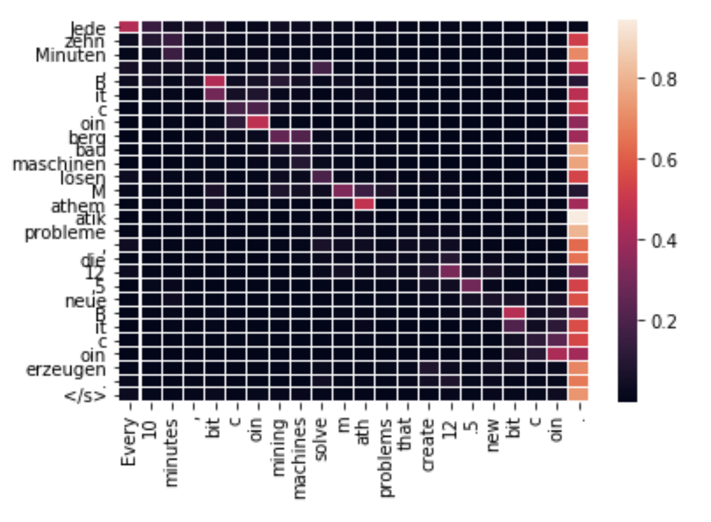

# Transformer-py

PyTorch implementation of machine translation model in ["Attention is All You Need"](https://arxiv.org/abs/1706.03762).

Offical implementation in TensorFlow at [here](https://github.com/tensorflow/tensor2tensor).

There are many other PyTorch implementations. This repo is different in:

1. Trained on a larger data set that is close to the original paper. ([3M en-de sentence pairs](https://github.com/zhangxiangnick/Transformer-py/blob/master/download_en_de.sh), the original paper uses 4.5M).

2. Followed the original paper with byte pair encoding and label smoothing.


## Performance

Dev data set: newstest2014+2015. Perplexity: 10.8.

Test data set: newstest2016. BLEU: 20.53.

## Example
```python
from Model import Transformer
from Translator import Translator

# Load Transformer model and byte pair encoding model.
model = Transformer(bpe_size=32000, h=8, d_model=512, p=0.1, d_ff=1024).cuda()
model.load_state_dict(torch.load("epoch60_acc_58.90_ppl_10.85.pt")["model"])
translator = Translator(model, "en-de_bp3_32000.model")

# Translate one sentence.
target, attn = translator.translate("Every 10 minutes, bitcoin mining machines solve math problems that create 12.5 new bitcoin.")
print(target)
# > Jede zehn Minuten, Bitcoinbergbaumaschinen lösen Mathematikprobleme, die 12,5 neue Bitcoin erzeugen.

# Plot attention heatmap (average of 8 heads).
translator.attention_heatmap(attn)
```
<p align="center"></p>
Words such as "Bitcoin" and "12.5" are aligned with source word pieces correctly.

See [demo](https://github.com/zhangxiangnick/Transformer-py/blob/master/demo.ipynb) notebook.
## Limitations

1. Memory footprint is high. The largest batch size I used is only 96 with 11GB memory. 

2. No support for multi-GPU yet.


